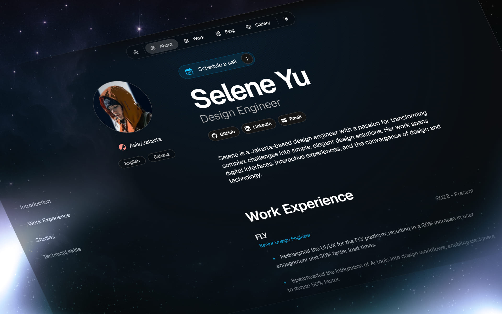

# 🚀 Rafa Teixeira – Portfolio

Personal portfolio built with [Once UI](https://once-ui.com) and [Next.js](https://nextjs.org), focused on performance, minimalist design, and fully customizable theming.

🔗 [Live Demo](https://rafactx.dev) (to be updated after deployment)



---

## 🛠️ Tech Stack

- [Next.js](https://nextjs.org)
- [TypeScript](https://www.typescriptlang.org/)
- [Once UI](https://once-ui.com)
- [Tailwind CSS](https://tailwindcss.com)
- [pnpm](https://pnpm.io)

---

## ⚙️ Getting Started Locally

Requirements:

- Node.js 18.17+ (or newer)
- pnpm (`npm i -g pnpm`)

### Steps:

```bash
# 1. Install dependencies
pnpm install

# 2. Start the development server
pnpm dev

# 3. Customize visual configuration
src/app/resources/config.js

# 4. Edit your content
src/app/resources/content.js

# 5. Create blog posts or projects
src/app/blog/posts/*.mdx
src/app/work/projects/*.mdx
```

---

## ✨ Features

- 🎨 Fully themeable via design tokens
- 🌙 Light/Dark mode support
- 🔐 Password-protected pages (optional)
- 🌐 Localization ready with `next-intl` (coming soon)
- 🧠 Automated SEO: Open Graph + JSON-LD schema
- ⚡ Instant deployment via [Vercel](https://vercel.com)

---

## 📁 Project Structure

```bash
.
├── public/                # Static assets
├── src/
│   ├── app/               # Routes and pages
│   ├── components/        # Reusable components
│   ├── resources/         # Config, content, theming
│   └── once-ui/           # Tokens and UI overrides
├── .gitignore
├── package.json
├── README.md
└── tsconfig.json
```

---

## 🧠 About the Project

This portfolio serves as a showcase of my work, built with a premium UI inspired by platforms like Stripe, Linear, and Apple.
It also acts as a foundation for future documentation and experimentation with UI systems.

---

## 🚀 Deploy on Vercel

You can clone and deploy your own version with one click:

[](https://vercel.com/new/clone?repository-url=https%3A%2F%2Fgithub.com%2Frafactx%2Fportfolio)

---

## 📄 License and Attribution

This project uses [Once UI](https://once-ui.com) under the [Creative Commons BY-NC 4.0 License](https://creativecommons.org/licenses/by-nc/4.0/).
It is intended for personal and non-commercial use only.
Attribution is included in this README and source code as required.

---

## 🤝 Contact

Find me on [LinkedIn](https://www.linkedin.com/in/rafactx/) or [Instagram @nerdstack.dev](https://instagram.com/nerdstack.dev)

---

_This project is part of NerdStack.dev — modern solutions for APIs, AI, automation, and professional portfolios._
